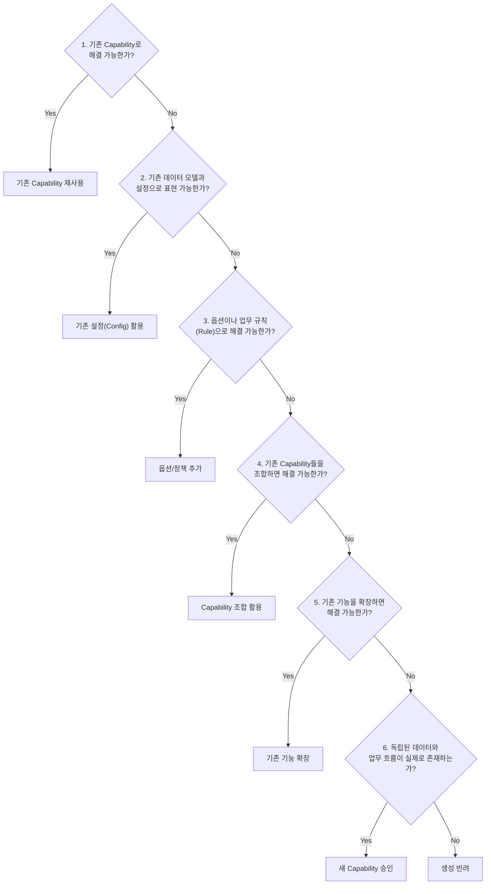

# MOA Architecture Boundaries

> 최종 개정일: 2026-10-09  
> 기준: Moa-v2 Core–Capability–Preset 아키텍처 원칙 개정  
> 기준 브랜치: `main`  
> 검증: `npm run lint` 통과, `npm run test:architecture` 통과

---

## 목적

Moa-v2의 전방위 다업종 확장을 위해 **Core – Capability – Preset** 3계층 아키텍처 원칙을 엄격하게 수립한다.  
새로운 업종(사업종류)이나 기능을 추가하더라도 기존 Core, 기존 Capability에 **연쇄 변경이 발생하지 않는** 견고한 경계를 유지한다.

**별도의 Domain Capability 계층은 만들지 않는다.**

이 문서는 각 레이어의 책임 경계, import 규칙, 금지 패턴, 신규 Capability 생성 승인 규칙, Preset 조합 원칙, 그리고 향후 개발 시 자동 검사 및 코드 리뷰 기준을 정의한다.

---

## 레이어 구조 개요 (Core – Capability – Preset)

```
┌─────────────────────────────────────────────────────────┐
│  Refine (dataProvider / authProvider / accessControl)   │
├─────────────────────────────────────────────────────────┤
│  1. MOA Core                                            │
│  src/core/  +  src/providers/                           │
│  (인증, 테넌트 격리, 공통 권한 기반, 공통 설정, 확장 인터페이스) │
├─────────────────────────────────────────────────────────┤
│  2. Capability                                          │
│  src/capabilities/                                      │
│  (독립 업무 영역, 업종 중립적 재사용 도메인 로직)             │
├─────────────────────────────────────────────────────────┤
│  3. Preset                                              │
│  src/core/presets/  (또는 app/presets/)                  │
│  (Capability + 설정 조합, 업종별 사업장 관리 프로그램 구성)   │
├─────────────────────────────────────────────────────────┤
│  Shared  (src/shared/)                                  │
├─────────────────────────────────────────────────────────┤
│  Infrastructure                                         │
│  src/lib/supabase/  src/services/  src/services/storage │
├─────────────────────────────────────────────────────────┤
│  Supabase (PostgreSQL / RLS / RPC)                      │
└─────────────────────────────────────────────────────────┘
```

> **[!IMPORTANT]**  
> Moa-v2의 최종 구조는 **1. Core, 2. Capability, 3. Preset** 3가지뿐이다.  
> 불필요한 계층 복잡성을 초래하는 "Domain Capability" 같은 중간 계층은 일절 생성하지 않는다.

---

## 1. Refine (Application Framework Layer)

### 책임

| 항목 | 내용 |
|------|------|
| 표준 CRUD | list / show / create / edit / delete 폼 및 테이블 UI |
| 상태 관리 | form state, loading/error state |
| 서버 통신 | server query/cache (TanStack Query 위임) |
| 라우팅 | resource routing, URL sync |
| 어댑터 | auth adapter, access control adapter |

### 실제 위치

```
src/providers/authProvider.ts          ← Refine AuthProvider 구현
src/providers/accessControlProvider.ts ← Refine AccessControlProvider 구현
src/providers/dataProvider.ts          ← Refine DataProvider 구현
src/App.tsx                            ← <Refine> 선언 및 resource 목록
```

### Import 규칙

| 허용 | 금지 |
|------|------|
| `@refinedev/core`, `@refinedev/react-router` | 업종 고유 로직 직접 참조 |
| `src/core/auth`, `src/core/organizations` | 개별 업종 폴더 직접 import |
| `src/core/authorization` | |
| `src/lib/supabase` | |
| `src/services/storage` (StorageService) | |

### 경계 규칙

- **Refine은 MOA의 업무 규칙을 결정하지 않는다.**
- `accessControlProvider`는 `MOA 권한 엔진(authorizationApi)`에 위임하며, 자체적인 역할별 조건문을 갖지 않는다.
- `authProvider`는 Supabase 세션과 StorageService를 통해 role을 읽으며, 조직/역할 계산 로직을 직접 소유하지 않는다.

---

## 2. MOA Core

### 책임

Core는 플랫폼의 근간이 되는 기반 기능을 담당한다.

| 항목 | 경로 |
|------|------|
| 인증 통합 | `src/core/auth/` |
| 조직/멤버십/테넌트 격리 | `src/core/organizations/` |
| 공통 권한 기반 (인가 엔진) | `src/core/authorization/` |
| 사업장 등록·온보딩 기반 | `src/core/accounts/`, `src/core/organizations/` |
| 공통 설정 및 플랫폼 인터페이스 | `src/core/platform/`, `src/core/locations/` |
| 확장 인터페이스 및 플러그인 계약 | `src/core/industry/pluginTypes.ts`, `pluginHost.ts` |
| 프리셋 인터페이스/엔진 | `src/core/presets/types.ts`, `presetAssembler.ts` |

### Core 핵심 규칙

1. **Core는 특정 업종과 개별 Capability의 업무 의미를 몰라야 한다.**
2. Core는 인증, 테넌트 격리, 공통 권한 기반, 공통 설정, 확장 인터페이스 등 기반 기능만을 담당한다.
3. **Core가 `attendance`, `booking`, `inventory`, `piano`, `pilates` 같은 개별 기능이나 업종을 직접 참조하는 구조를 새로 만들지 않는다.**
4. 단, Capability를 등록하고 실행하기 위한 **일반적인 인터페이스(Generic Interface, Dynamic Registry, Injection Slot)**는 허용한다.

### Import 규칙

| 허용 | 금지 |
|------|------|
| `src/shared/*` | ❌ `src/capabilities/*` 구체 구현체 직접 import |
| `src/lib/supabase/*` | ❌ `src/industries/*` 직접 import |
| `src/services/*` | ❌ 특정 업종 고유 비즈니스 로직 포함 |
| 내부 `src/core/*` | ❌ 개별 Capability의 업무 도메인 로직 포함 |

### 금지 패턴

```typescript
// ❌ Core에서 특정 업종이나 개별 Capability 의미를 직접 분기하지 않는다
if (industry === 'piano') { /* ... */ }
if (capability === 'attendance') { /* ... */ }

// ✅ 일반적인 인터페이스(플러그인/슬롯/동적 레지스트리)로 위임한다
const extension = getRegisteredExtension(slotId);
extension.execute();
```

---

## 3. Capability

### 책임

Capability는 **독립적인 업무 영역**을 담당하며, 특정 업종에 종속되지 않는 재사용 가능한 비즈니스 단위다.

| Capability (예시) | 경로 | 설명 |
|-------------------|------|------|
| roster | `src/capabilities/roster/` | 원생/회원 명부 관리 |
| scheduling | `src/capabilities/scheduling/` | 시간표 및 수업 스케줄링 |
| booking | `src/capabilities/booking/` | 예약 및 타석/좌석/레슨 신청 |
| billing | `src/capabilities/billing/` | 청구, 수강료 결제, 정기 과금 |
| attendance | `src/capabilities/attendance/` | PIN/QR 출결 체크 및 이력 |
| commerce | `src/capabilities/commerce/` | 상품 판매, 재고, 포인트 원장 |
| locker | `src/capabilities/locker/` | 사물함 및 락커 배정/관리 |
| passes | `src/capabilities/passes/` | 횟수권/기간권 이용권 발행 및 차감 |
| seat_room | `src/capabilities/seat_room/` | 룸/공간/좌석 점유 타이머 |
| treatment_chart | `src/capabilities/treatment_chart/` | 시술 차트 및 고객 이력 |

### Capability 핵심 규칙

1. **Capability는 독립적인 업무 영역을 담당한다.**
2. **여러 업종에서 같은 본질의 업무가 필요하면 하나의 Capability를 재사용한다.**
3. **업종 이름만 달라졌다는 이유로 새로운 Capability를 만들지 않는다.**
4. 업종별 차이는 기존 Capability의 설정(setupSchema), 옵션(options), 정책(policy), 업무 규칙(business rules)으로 표현할 수 있는지 먼저 검토한다.
5. Capability 내부에서 업종에 따른 분기(`if (industry === 'piano')`)를 누적하지 않는다.

### 새로운 Capability 생성 승인 규칙 (6단계 필수 검증)

새 Capability를 만들기 전에 반드시 다음 6단계를 검토하고 확인해야 한다.



1. **기존 Capability로 해결 가능한가?**
2. **기존 데이터 모델과 설정으로 표현 가능한가?**
3. **옵션이나 업무 규칙으로 해결 가능한가?**
4. **기존 Capability를 조합하면 해결 가능한가?**
5. **기존 기능을 확장하면 해결 가능한가?**
6. **그래도 해결할 수 없다면 독립된 데이터와 업무 흐름이 실제로 존재하는가?**

> **[!CAUTION]**  
> - 기존 기능을 확장하는 것보다 새 Capability를 만드는 것이 **명확하게 유리한 경우에만** 추가한다.  
> - 단순한 필드, 버튼, 검색, 알림, 바코드, 통계 같은 요소를 그 자체로 독립 Capability로 만들지 않는다.  
> - 단, 이러한 기능도 독립된 업무 생명주기와 책임이 명확하다면 별도로 검토할 수 있다.

### Import 규칙

| 허용 | 금지 |
|------|------|
| `src/core/*` (공통 기반 및 계약 인터페이스) | ❌ `src/industries/*` 직접 import |
| `src/shared/*` | ❌ 특정 업종 전용 업무 규칙 포함 |
| `src/lib/supabase/*` | ❌ 업종명 기반 `if (industry === ...)` 조건문 |
| `src/services/*` | |
| 다른 Capability (명시적 의존성) | |

---

## 4. Preset

### 책임

Preset은 **필요한 Capability와 설정을 조합해 업종별 사업장 관리 프로그램을 구성**하는 선언적 조립 단위다.

| 항목 | 내용 |
|------|------|
| Capability 조합 선언 | `capabilities: ['passes', 'booking', 'locker', ...]` |
| 온보딩 설정 스키마 통합 | 각 Capability의 `setupSchema` 취합 |
| 프레임워크 리소스 맵 통합 | 각 Capability의 Refine `resources` 취합 |
| 업종별 어휘 및 레이블 매핑 | 용어집(학생/회원/고객, 교습비/이용료/회비 등) 매핑 |

### Preset 핵심 규칙

1. **Preset 자체에 중복된 업무 로직을 구현하지 않는다.**
2. **업종별 애플리케이션을 복제하지 않는다.**
3. 모든 비즈니스 실행은 결합된 Capability의 도메인 로직에 위임한다.
4. 신규 업종 도입 시 새로운 애플리케이션 코드를 복제 작성하는 것이 아니라, 기존 Capability와 설정을 조합하는 Preset 정의만 추가한다.

### 레거시 Industry 코드와의 관계 및 전환 방침

- 현재 코드베이스의 `src/industries/*`에 존재하는 기존 업종별 구현(피아노, 데이케어, 헬스 등)은 **기존 정상 동작과 서비스 안정성을 위해 보존**된다.
- 그러나 향후 신규 기능 개발 및 신규 업종 확장은 개별 애플리케이션 복제가 아닌 **Preset + Capability 조립 원칙**을 엄격히 적용한다.
- 기존 업종 전용 기능 중 공통 본질을 갖는 부분은 점진적으로 Capability로 승격/통합한다.

---

## 5. Supabase & Infrastructure

### 책임

| 항목 | 내용 |
|------|------|
| 데이터 저장 | PostgreSQL |
| 테넌트 격리 | RLS (Row Level Security) |
| 원자 트랜잭션 | RPC (Stored Procedure) |
| 오프라인 연속성 | StorageService (인메모리 캐시 + 오프라인 스냅샷 + Outbox) |

### 프론트엔드 vs DB 보안 경계

- 프론트엔드 권한 체크(`accessControlProvider`, `useCan`)는 **UX 편의(화면 제어)** 목적이다.
- 실제 데이터 무결성과 멀티테넌트 격리는 **Supabase RLS와 원자적 RPC**가 절대적으로 보증한다.

---

## 6. 현재 코드베이스 상태 및 충돌 정리

### ✅ 확립된 격리 영역
1. **Industry 카탈로그 단일화**: `definitions.ts`가 단일 원천이며, capability 조합이 분리됨.
2. **권한 엔진 캡슐화**: `authorizationApi`를 통해서만 인가 판정 수행.
3. **스토리지 어댑터 정규화**: StorageService가 개별 업종 이름 분기 없이 capability 단위로 동작.
4. **`src/core/academy` 영구 금지**: 과거 역사적 이유로 존재했던 academy 코드는 완전히 제거되었으며, CI 규칙(`CORE_ACADEMY_FORBIDDEN_MESSAGE`)으로 영구 차단됨.

### ⚠️ 아직 자동화/격리되지 않은 규칙 (향후 과제 및 코드 리뷰 필수 기준)

| 항목 | 현황 및 영향 | 향후 과제 및 대응 |
|------|-------------|-------------------|
| **Core의 Capability 정적 참조** | `src/core/presets/presetRegistry.ts`가 17개 Capability의 setupSchema/resources를 정적으로 import 중임 | Core가 개별 Capability를 직접 아는 구조적 위반 상태. 향후 프리셋 조립 엔진을 Core 외부(Composition 계층)로 분리하거나 동적 런타임 등록 방식으로 개선 필요. |
| **새 Capability 승인 6단계 게이트** | 새 Capability 디렉터리 생성 시 6단계 검토 자동 린터 부재 | PR 제출 및 코드 리뷰 시 6단계 질문 체크리스트를 필수 작성하도록 수동 리뷰 강제. |
| **업종별 앱 복제 차단** | `src/industries/<new>` 복제를 차단하는 자동 검사 부재 | 신규 업종 요구 시 Preset 정의만 추가하도록 코드 리뷰에서 엄격히 제한. |

---

## 7. 향후 개발 체크리스트 & 코드 리뷰 기준

### 새로운 기능 요구사항 발생 시
- [ ] 1. 기존 Capability로 해결 가능한가?
- [ ] 2. 기존 데이터 모델과 설정으로 표현 가능한가?
- [ ] 3. 옵션이나 업무 규칙으로 해결 가능한가?
- [ ] 4. 기존 Capability를 조합하면 해결 가능한가?
- [ ] 5. 기존 기능을 확장하면 해결 가능한가?
- [ ] 6. 그래도 해결할 수 없다면 독립된 데이터와 업무 흐름이 실제로 존재하는가?
- [ ] 단순 UI 요소(버튼, 검색, 통계 등)를 독립 Capability로 만들지 않았는가?

### 신규 업종 지원 요구사항 발생 시
- [ ] 애플리케이션 코드를 복제하지 않았는가? (`src/industries/` 신규 앱 복제 금지)
- [ ] 필요한 Capability들의 조합으로 Preset(`INDUSTRY_PRESETS`)을 정의했는가?
- [ ] Preset 내부에 별도 비즈니스 로직을 중복 구현하지 않았는가?

### 코드 리뷰 기준
- [ ] **Core가 Capability를 아는가?**: Core에 특정 Capability 이름이나 import가 추가되지 않았는가?
- [ ] **Core에 업종 분기가 있는가?**: Core에 `if (industry === '...')` 패턴이 추가되지 않았는가?
- [ ] **Capability에 업종 분기가 있는가?**: Capability에 `if (industry === '...')` 패턴이 추가되지 않았는가?
- [ ] **별도의 Domain Capability 계층이 만들어지지 않았는가?**: 오직 Core, Capability, Preset 3계층만 존재하는가?
