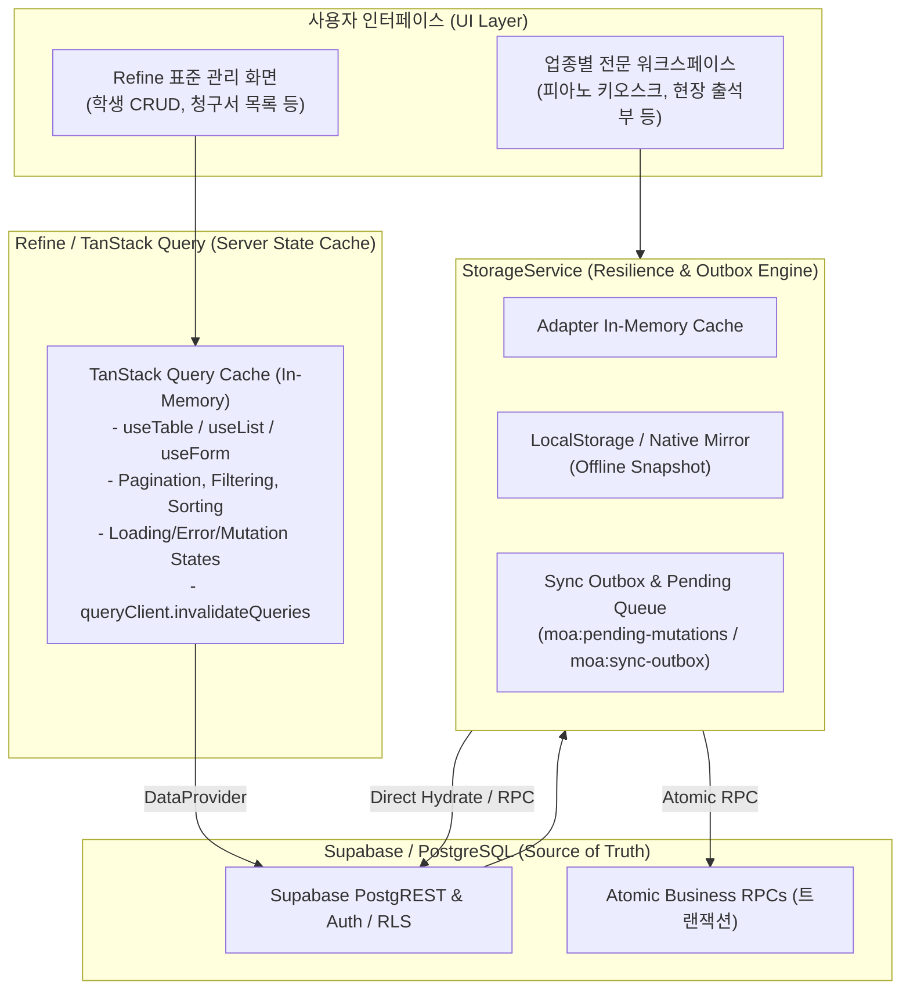
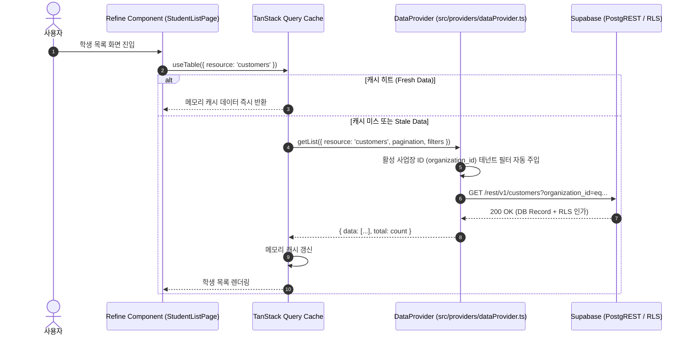
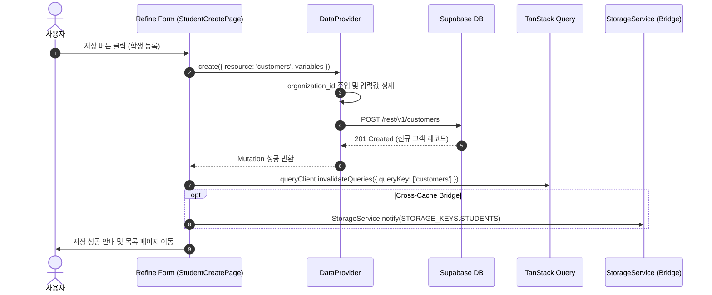
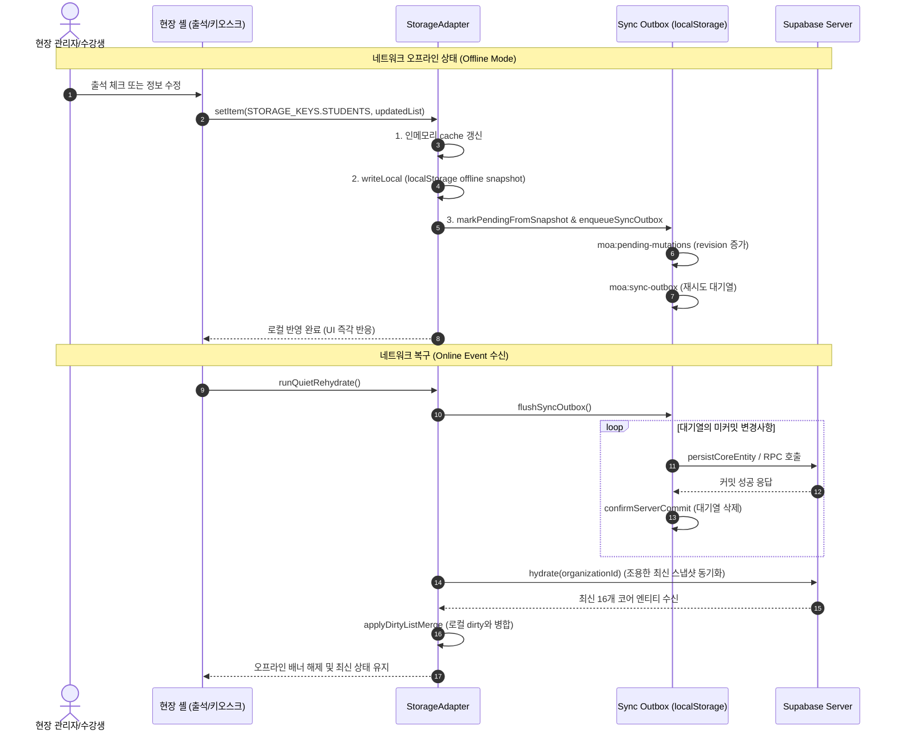
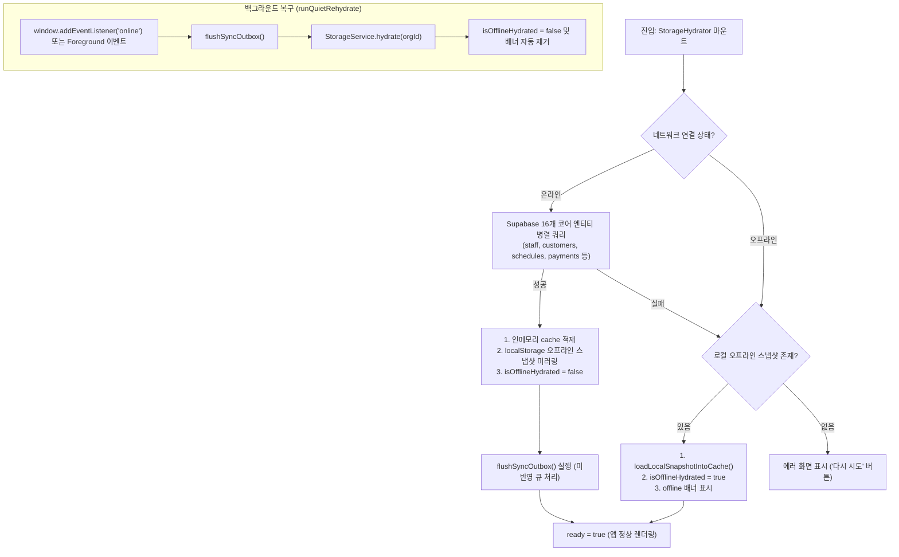
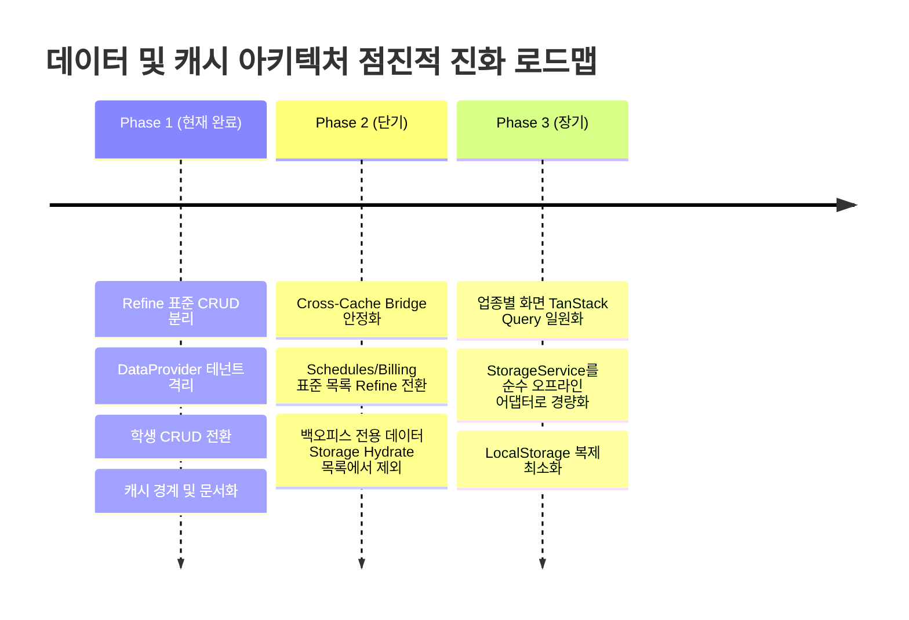

# MOA v2 Data & Cache Boundary Architecture

이 문서는 **Project Moa v2**에서 **Refine v5 / TanStack Query v5**와 **기존 StorageService (오프라인 회복성 계층)** 간의 데이터 및 캐시 책임을 명확히 정의하고, 두 계층 간의 상호작용 및 정합성 보장 정책을 규정합니다.

---

## 1. 아키텍처 개요 및 핵심 원칙

MOA v2는 고성능 백오피스 관리 UI를 위한 **표준 서버 상태 캐시(TanStack Query)**와 현장 태블릿·키오스크·모바일 네이티브 환경을 위한 **오프라인 영속성 계층(StorageService)**을 결합하여 운영합니다.

### 핵심 분리 원칙

1. **Refine / TanStack Query는 서버 상태(Server State)의 화면 단위 단기 캐시**입니다.
   - 브라우저 메모리에 상주하며, 컴포넌트 생명주기 및 사용자 상호작용(페이지 전환, 필터 변경, 검색)에 최적화되어 있습니다.
   - 영속적인 오프라인 큐나 로컬 저장소 쓰기 보증을 담당하지 않습니다.
2. **StorageService는 현장 연속성을 위한 오프라인 스냅샷 및 쓰기 지연(Outbox) 엔진**입니다.
   - 네트워크 단절 시에도 현장(학원 키오스크 출석, 룸 예약 등)이 중단 없이 동작할 수 있도록 스냅샷을 제공합니다.
   - 오프라인 상태에서 발생한 변경사항을 추적하고, 네트워크 복구 시 원자적으로 동기화합니다.
3. **StorageService를 TanStack Query의 또 다른 단순 서버 캐시로 전락시키지 않으며, 반대로 복잡한 오프라인 Outbox/Rehydrate 복구 엔진을 Refine으로 억지 이전하지 않습니다.**

---

## 2. 역할 분담 비교 매트릭스

| 항목 | Refine / TanStack Query | StorageService (기존 계층) |
|---|---|---|
| **저장 위치** | 브라우저 RAM (메모리 쿼리 캐시) | RAM (`cache`) + `localStorage` (스냅샷/Outbox) |
| **수명 주기 (TTL)** | 화면 닫힘/새로고침 시 초기화 (staleTime/gcTime) | 영구 보관 (조직 변경 또는 로그아웃 시 명시적 소멸) |
| **주요 사용 대상** | 백오피스 표준 CRUD (원생 관리, 통계, 청구 목록 등) | 업종별 현장 워크스페이스, 출석 키오스크, 오프라인 모드 |
| **조회 단위** | 화면/페이지 단위 (Pagination, Filters, Sorters) | 조직(Organization) 단위 16개 코어 엔티티 일괄 스냅샷 |
| **오프라인 동작** | 네트워크 단절 시 요청 실패 (Error State) | 로컬 스냅샷 자동 폴백 (`isOfflineHydrated() === true`) |
| **쓰기 처리 방식** | 서버 즉시 반영 (낙관적/비관적 API 호출) | 로컬 미러 즉시 반영 + Outbox 큐 적재 + 지연 동기화 |
| **캐시 갱신 방식** | `queryClient.invalidateQueries({ queryKey })` | `StorageService.notify(key)` 및 이벤트 리스너 |
| **로그아웃 보호** | 없음 (세션 종료 시 캐시 폐기) | `prepareSignOut`: 미전송 Outbox 변경 감지 시 차단 |

---

## 3. 데이터 흐름 상세 (Data Flow Architecture)

### 3.1 온라인 데이터 흐름 (Online Query Flow)

Refine 표준 화면(예: `/students`)에서 데이터를 조회할 때의 표준 흐름입니다.

### 3.2 온라인 뮤테이션 흐름 (Online Mutation Flow)

Refine 화면에서 신규 등록/수정/삭제 시의 표준 흐름입니다.

### 3.3 오프라인 및 Outbox 데이터 흐름 (Offline & Resilience Flow)

네트워크가 단절된 오프라인 환경(예: 지하 연습실, Wi-Fi 불안정)에서의 안전한 데이터 처리 흐름입니다.

### 3.4 재하이드레이션 흐름 (Rehydrate Flow)

사용자가 사업장에 진입하거나 네트워크가 복구될 때 `StorageHydrator`가 수행하는 단계입니다.

---

## 4. 데이터 저장 위치 및 정책 매트릭스 (Data Placement Matrix)

`src/core/storage/persistencePolicy.ts`의 원칙에 따라 데이터별 저장 위치와 소유권을 분류합니다.

| 정책 (Policy) | 해당 데이터 / 엔티티 | 원본 위치 (Source of Truth) | TanStack Query 역할 | StorageService 역할 |
|---|---|---|---|---|
| **`server-authoritative`** | 수강료 결제(`payments`), 청구서(`invoices`), 수강권(`session_passes`), 일정(`schedules`), 교재 결제 | **Supabase DB (PostgreSQL 원장)** | 온라인 목록/상세 화면 쿼리 (`useTable`, `useShow`) | 오프라인 읽기용 스냅샷만 제공 (로컬 단독 쓰기 확정 불가, 원자적 RPC 전용) |
| **`server-with-local-cache`** | 원생 기본정보(`customers`), 강사(`staff`), 학원설정(`settings`), 출석세션(`attendance_sessions`) | **Supabase DB (PostgreSQL)** | 관리자 화면 표준 CRUD 캐시 (`useTable`, `useForm`) | 오프라인 캐시 및 단기 변경 Outbox 큐잉 지원 |
| **`offline-command`** | 미전송 변경 대기열 (`moa:pending-mutations:*`, `moa:sync-outbox:*`) | **Client Command Queue (LocalStorage)** | 해당 없음 (접근 안 함) | 오프라인 쓰기 보존, 버전/리비전 관리, 온라인 시 순차 재시도 |
| **`local-only`** | 활성 사용자(`active_user`), 온보딩 진행 상태, UI 임시 상태, 셔틀 임시 요청 | **Client Device (LocalStorage)** | 해당 없음 | 로컬 디바이스 전용 영속화 (`writeLocal`) |

---

## 5. 이중 캐시(Double Caching Surface) 분석 및 정합성 보장

### 5.1 동일 데이터를 두 캐시가 동시에 보관하는 지점

| 엔티티 | Refine / TanStack Query 캐시 | StorageService 캐시 | 중복 목적 및 차이점 |
|---|---|---|---|
| **학생/원생 (`customers`)** | `['customers', 'list', ...]` `['customers', 'detail', id]` | `STORAGE_KEYS.STUDENTS` (`piano_app_students`) | - **Refine**: 백오피스 검색, 필터링, 페이지 단위 표시용. - **Storage**: 피아노 레슨 화면, 현장 키오스크 등 오프라인 배치가 필요한 업종 셸 전용. |
| **수업/일정 (`schedules`)** | `['schedules', ...]` (예정) | `STORAGE_KEYS.SCHEDULES` (`core_schedules`) | - **Refine**: 관리자용 일정 리스트/테이블 뷰. - **Storage**: 시간표 드래그앤드롭 캘린더, 오프라인 출석부. |
| **수강료 청구서 (`tuition_invoices`)** | `['tuition_invoices', ...]` (예정) | `STORAGE_KEYS.INVOICES` (`piano_app_invoices`) | - **Refine**: 관리자 수강료 수납 대장 목록/필터. - **Storage**: 원생 프로필 내부 결제 이력 탭 오프라인 조회. |

### 5.2 캐시 불일치(Cache Inconsistency) 방지 정책

두 계층이 공존하는 과도기 동안 다음 정합성 규칙을 엄격히 적용합니다:

1. **단방향 CUD 전파 (Cross-Cache Invalidation)**:
   - Refine 화면에서 `customers` CUD가 발생한 경우:
     - TanStack Query 캐시는 Refine의 내장 메커니즘으로 자동 무효화(`invalidateQueries`).
     - 동시에 `StorageService.notify(STORAGE_KEYS.STUDENTS)` 또는 필요 시 로컬 미러를 갱신하여 업종 화면의 stale 상태를 해소합니다.
2. **복합 트랜잭션의 단일 창구화**:
   - 수강료 결제(`record_combined_payment`), 출석 차감(`attendance_status_with_pass_atomic`)과 같은 복합 업무 규칙은 **절대 Refine의 단순 DataProvider update를 타지 않고 MOA 원자적 RPC를 호출**합니다.
   - RPC 성공 후 `writeLocalMirror`를 통해 로컬 캐시를 맞추고, TanStack Query의 관련 키(`tuition_invoices`, `customers`)를 `queryClient.invalidateQueries`로 함께 무효화합니다.
3. **Outbox Flush 시 화면 캐시 갱신**:
   - 오프라인 상태에서 누적된 Outbox가 온라인 복구 후 `flushSyncOutbox()`를 통해 서버에 반영되면, TanStack Query의 쿼리 캐시도 함께 무효화하여 화면에 최신 서버 데이터가 표시되도록 합니다.

---

## 6. 향후 점진적 중복 정리 로드맵 (Deprecation Roadmap)

> [!IMPORTANT]
> **원칙**: 오프라인 연속성과 현장 구동성을 검증하지 않은 상태에서 `StorageService`를 성급히 삭제하지 않습니다.

### 단계별 정리 계획

1. **Phase 1 (현재 상태)**:
   - 학생 표준 CRUD를 Refine으로 완전히 이관.
   - TanStack Query와 StorageService의 명확한 경계 수립 및 아키텍처 문서화.
2. **Phase 2 (단기 목표 - 무거운 백오피스 데이터 분리)**:
   - 과거 회계 결산, 복합 매출 통계, 대규모 알림 로그 등 **오프라인 현장에서 필요 없는 엔티티를 `hydrateCoreEntities` 대상에서 제외**.
   - 해당 엔티티들은 Refine `useTable` / `useList`를 통해 필요할 때만 서버에서 온디맨드로 쿼리하도록 전환하여 초기 로딩(Hydrate) 속도 대폭 개선.
3. **Phase 3 (장기 목표 - 오프라인 어댑터 일원화)**:
   - 업종별 화면(피아노, 필라테스 등)도 기본적으로 React Query 기반 훅을 사용하도록 점진적 통합.
   - `StorageService`는 거대한 인메모리 데이터 덤프 대신 TanStack Query의 오프라인 퍼시스터(Persister) 및 Outbox 전송 전용 경량 백엔드로 재구성.

---

## 7. 보안 및 테넌트 무결성 보장

1. **테넌트 격리(Tenant Boundary)**:
   - Refine TanStack Query 캐시의 모든 쿼리 키는 활성 사업장 ID(`organization_id`) 스코프 내에서 격리됩니다.
   - 사업장이 전환되면 TanStack Query 캐시 전체가 리셋(`queryClient.clear()`)되고, StorageService도 `clearOrganization()`을 호출하여 교차 테넌트 데이터 유출을 원천 차단합니다.
2. **로그아웃 시 미전송 데이터 보호**:
   - `prepareSignOut`: 사용자가 로그아웃을 시도할 때 동기화되지 않은 Outbox 변경사항(`hasUnsyncedBusinessChanges()`)이 남아있는 경우 즉시 차단하거나 flush를 안내하여 현장 데이터 유실을 방지합니다.
   - 로그아웃 확정 시 `clearBusinessCachesOnSignOut`을 통해 로컬에 남아있는 비즈니스 캐시 스냅샷을 안전하게 파기합니다.
